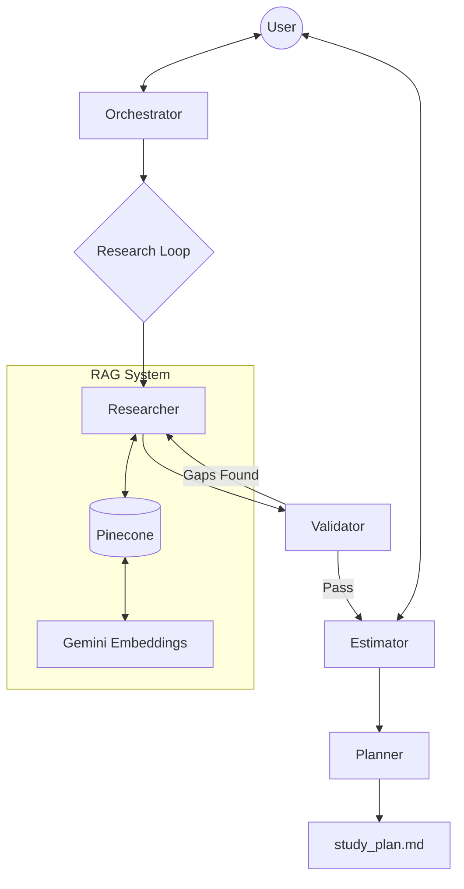

# b(x) Theory -- AI Exam Study Planner

This project is an advanced **Multi-Agent RAG (Retrieval-Augmented Generation) System** designed to create personalized exam study plans. It ingests course syllabi and textbooks, parses them into structured topics, and uses a team of AI agents to research, validate, estimate, and schedule a comprehensive study guide.

The system is built on **Google's Agent Development Kit (ADK)** and uses **Gemini 2.5** models for reasoning and embeddings, with **Pinecone** as the vector database.

---

## 🏗 Architecture & Program Flow

The application follows a **sequential agent pipeline** with an embedded **generator-critic loop** for quality assurance.

### High-Level Flow
1.  **Ingestion**: Textbooks and syllabi are parsed, chunked, embedded, and indexed.
2.  **Orchestrator (HITL 1)**: User configures study depth and timeline for each course.
3.  **Generator-Critic Loop**:
    *   **Researcher**: Retrieves textbook content for topics.
    *   **Validator**: Checks if retrieved content covers syllabus keywords.
    *   *Loop repeats if validation fails.*
4.  **Estimator (HITL 2)**: AI estimates study time per topic; User reviews and adjusts.
5.  **Planner**: Generates the final day-by-day `study_plan.md`.

### Component Diagram


---

## 🛠️ Setup & Installation

### Prerequisites
*   **Python 3.10+**
*   **Pinecone API Key**: For vector storage.
*   **Google Gemini API Key**: For embeddings and agent reasoning.

### Environment Variables
Create a `.env` file in the root directory:
```bash
PINECOME_API_KEY="your_key_here"
PINECONE_INDEX_NAME="study-planner-agents"
EMBEDDING_GEMINI_API_KEY="your_key_here"
RETRIEVAL_GEMINI_API_KEY="your_key_here"
```

### Installation
```bash
# Create virtual environment
python -m venv env
source env/bin/activate

# Install dependencies
pip install -r requirements.txt
```

---

## 🚀 Ingestion Pipeline

Before the agents can run, you must process your data. The pipeline consists of three stages.

### 1. Parser (`src/tools/parser.py`)
Extracts topics and keywords from course syllabi (PDFs) using Gemini 2.5.
*   **Input**: `data/Syllabi/` and `data/Midterm Topics/`
*   **Output**: `data/artifact_store/syllabi.json`
*   **Logic**: Consolidates granular syllabus points into broad "Study Topics" to minimize vector search noise.

### 2. Chunking (`src/ingestion/chunking.py`)
Splits textbooks into **Parent** and **Child** chunks.
*   **Parent Chunk**: Large context window (~12,000 chars). Used for reading and validation.
*   **Child Chunk**: Small, overlapping window (~3,000 chars). Used for embedding and search.
*   **Strategy**: This "Small-to-Big" retrieval ensures high-precision search (child) while providing the agents with full context (parent).

### 3. Embedder & Indexer (`src/ingestion/embedder.py`, `src/ingestion/indexer.py`)
*   **Embedder**: Generates vectors for **Child Chunks** using `text-embedding-004`.
*   **Indexer**: Uploads vectors to Pinecone. Metadata includes links to the **Parent ID** so the full text can be retrieved later.

**Run the Ingestion:**
```bash
# 1. Parse Syllabi
python -m src.tools.parser

# 2. Chunk Textbooks
python -m src.ingestion.chunking

# 3. Generate Embeddings
python -m src.ingestion.embedder

# 4. Upload to Pinecone
python -m src.ingestion.indexer
```

---

## 🤖 The Agents

### 1. Orchestrator Agent (`src/agents/orchestrator.py`)
*   **Role**: Configuration & Intent Parsing.
*   **Function**: interactively asks the user about their study goals ("Deep Dive" vs "Light Review") and timeline ("5 days until midterm").
*   **Logic**: Uses Gemini to parse natural language inputs into structured configuration objects.

### 2. Researcher Agent (`src/agents/researcher.py`)
*   **Role**: Content Retrieval (The "Generator").
*   **Function**: Searches the vector database for textbook content matching the syllabus topics.
*   **Key Logic**:
    *   **Pass 1**: Broad search using topic name + all keywords.
    *   **Pass 2+ (Retry)**: Uses **Keyword Individualization**. If the Validator marks specific terms as missing, it performs targeted micro-searches for just those terms.
    *   **Deduplication**: Tracks retrieved IDs to ensure it never returns the same text twice.

### 3. Validator Agent (`src/agents/validator.py`)
*   **Role**: Quality Control (The "Critic").
*   **Function**: checks if the retrieved textbook content actually covers the keywords required by the syllabus.
*   **Logic**:
    *   Extracts text from **Parent Chunks**.
    *   Performs literal keyword matching against the text.
    *   If coverage < 40%, it flags the topic for a **Retry** and sends it back to the Researcher.

### 4. Estimator Agent (`src/agents/estimator.py`)
*   **Role**: Time Management (HITL 2).
*   **Function**: Calculates study duration based on content volume and difficulty.
*   **Logic**:
    *   Base time per chunk (e.g., 5 mins).
    *   **Formula Penalty**: Adds +50% time if the retrieved text contains LaTeX/Math formulas.
    *   Allows user to manually override times via natural language ("Give me 10 more minutes for Quantum").

### 5. Planner Agent (`src/agents/planner.py`)
*   **Role**: Scheduling & Output.
*   **Function**: Maps study blocks to specific calendar dates.
*   **Logic**:
    *   **Bin Packing**: Fits study blocks into daily slots (max 4 hours/day).
    *   **Prioritization**: Schedules nearest midterms first.
    *   **Markdown Generation**: Produces the final readable report with source page citations.

---

## 📂 Project Structure

```text
/
├── main.py                 # Entry point, defines the Agent Pipeline
├── src/
│   ├── agents/             # Agent definitions
│   │   ├── orchestrator.py
│   │   ├── researcher.py
│   │   ├── validator.py
│   │   ├── estimator.py
│   │   └── planner.py
│   ├── ingestion/          # Data processing pipeline
│   │   ├── chunking.py
│   │   ├── embedder.py
│   │   └── indexer.py
│   ├── tools/              # Shared tools & RAG client
│   │   ├── rag_client.py   # Pinecone interface
│   │   ├── parser.py       # Syllabus parsing
│   │   └── adk_tools.py    # Functions callable by agents
│   ├── models/             # Pydantic schemas (Shared State)
│   └── config.py           # Settings management
├── data/
│   ├── Syllabi/            # Input PDFs
│   ├── Textbooks/          # Input PDFs
│   ├── processed/          # Intermediate JSONs (parents, children, embeddings)
│   └── artifact_store/     # Parsed topic lists
└── scripts/                # Utility scripts (e.g., clear_pinecone.py)
```

## 🏃 Usage

**Start the Application:**
```bash
python main.py
```

**Workflow:**
1.  **Configure**: Tell the agent about your exams (e.g., "Physics is hard, 5 days away").
2.  **Wait**: Watch the Researcher and Validator loop until content is found.
3.  **Review**: The Estimator will propose study times. You can accept or adjust them.
4.  **Study**: Open `study_plan.md` and start working!